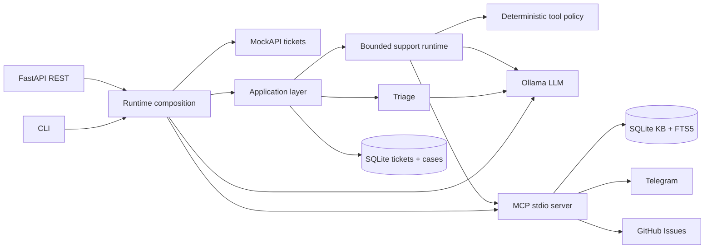
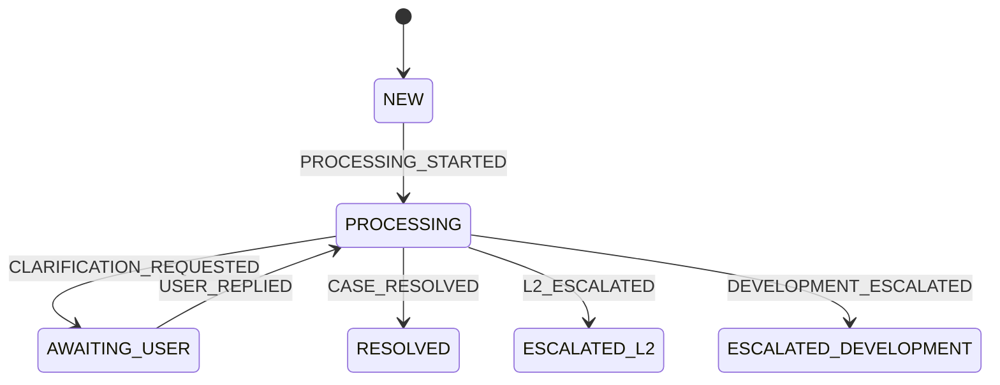
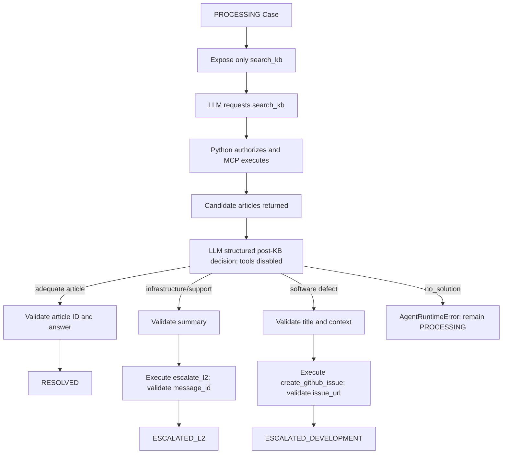
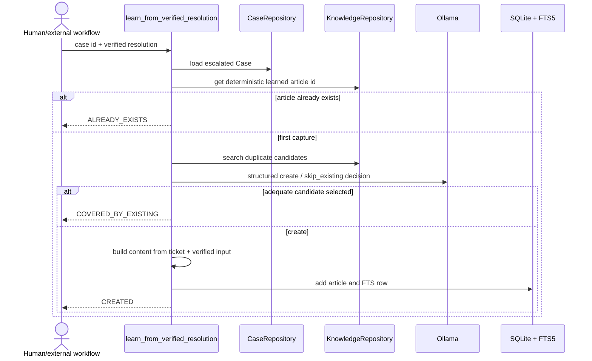
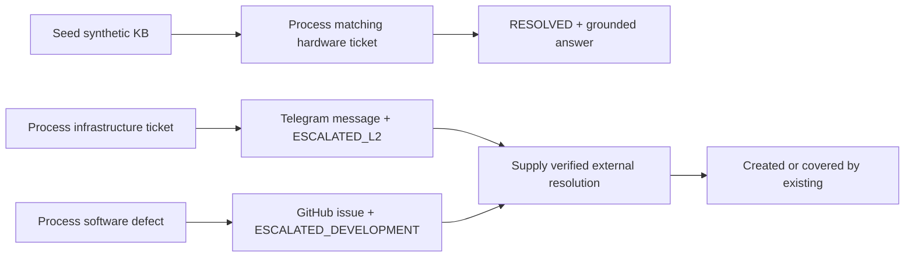

# L1 Support Agent

## 1. Project overview

A bounded single-agent support system for processing MockAPI tickets. The LLM interprets the ticket and selects an outcome; deterministic Python code controls tool visibility, validates every result, and applies lifecycle transitions.

Core invariant: **the model proposes; the runtime authorizes and validates.**

Technical detail: [docs/architecture.md](docs/architecture.md). Practical runbook: [docs/demo.md](docs/demo.md).

## 2. What the agent does

| Stage | Implemented behavior | Owner |
|---|---|---|
| Ingest | Fetch and persist a MockAPI ticket | [`process_ticket_by_id`](src/l1_support_agent/application/process_ticket.py) |
| Triage | Classify category and priority | [`triage_case`](src/l1_support_agent/application/triage_case.py) |
| Investigate | Search SQLite FTS5 through MCP | [`run_support_agent`](src/l1_support_agent/agent/runtime.py) |
| Decide | Resolve, escalate to L2, or create a GitHub issue | structured post-KB decision |
| Enforce | Filter tools, validate outputs, transition state | [`tool_policy.py`](src/l1_support_agent/application/tool_policy.py), [`process_case.py`](src/l1_support_agent/application/process_case.py) |
| Learn | Capture a caller-supplied verified resolution | [`learn_from_verified_resolution`](src/l1_support_agent/application/learn_from_resolution.py) |

## 3. Architecture at a glance



The CLI and REST API share [`interfaces.py`](src/l1_support_agent/interfaces.py). MCP stays a transport boundary; it does not decide whether a tool is allowed.

## 4. Ticket lifecycle



The legal transition table is in [`domain/transitions.py`](src/l1_support_agent/domain/transitions.py). Clarification states exist in the domain, but the current runtime does not implement the clarification flow.

## 5. Agent decision flow



```mermaid
sequenceDiagram
    actor Caller
    participant App as process_ticket_by_id
    participant Source as MockAPI
    participant DB as SQLite repositories
    participant Triage as triage_case
    participant Agent as process_case / runtime
    participant MCP as MCP server

    Caller->>App: ticket id
    App->>Source: GET ticket
    Source-->>App: Ticket
    App->>DB: save Ticket; load/create Case
    opt Case is NEW
        App->>Triage: classify ticket
        Triage-->>App: category + priority; PROCESSING
        App->>DB: save Case
    end
    App->>Agent: process PROCESSING Case
    Agent->>MCP: search_kb
    MCP-->>Agent: candidate articles
    Agent->>Agent: structured post-KB decision + validation
    alt KB resolution
        Agent-->>App: resolved answer
    else L2 escalation
        Agent->>MCP: escalate_l2
        MCP-->>Agent: message_id
    else development escalation
        Agent->>MCP: create_github_issue
        MCP-->>Agent: issue_url
    end
    App->>DB: persist final Case
    App-->>Caller: typed result
```

Terminal cases are idempotent: a repeated call returns the persisted state without another agent or external side effect.

## 6. Skills

Operational instructions ship inside [`src/l1_support_agent/skills/`](src/l1_support_agent/skills/) and are loaded explicitly by [`agent/skills.py`](src/l1_support_agent/agent/skills.py).

| Skill | Used by | Authority it has |
|---|---|---|
| `triage` | initial classification prompt | instructions only |
| `kb-investigation` | search and relevance prompts | instructions only |
| `l2-escalation` | post-KB routing prompt | instructions only |
| `development-escalation` | post-KB routing prompt | instructions only |
| `knowledge-update` | verified-resolution learning | instructions only |

Skills cannot grant tools, call integrations, or mutate a Case.

## 7. MCP tools

The stdio server in [`mcp/server.py`](src/l1_support_agent/mcp/server.py) exposes:

| Tool | Side effect/result | Runtime gate |
|---|---|---|
| `search_kb` | reads FTS5; returns `{"articles": [...]}` | PROCESSING, before KB search |
| `escalate_l2` | sends Telegram message; returns integer `message_id` | PROCESSING, after KB search |
| `create_github_issue` | creates issue; returns non-empty `issue_url` | PROCESSING, after KB search |

The generic adapter [`mcp/client.py`](src/l1_support_agent/mcp/client.py) converts MCP metadata to provider-neutral tool definitions.

## 8. Self-learning

Self-learning is explicit and never runs during normal ticket processing.



Only `ESCALATED_L2` and `ESCALATED_DEVELOPMENT` cases are eligible. The LLM may judge duplicate coverage and propose a title; it cannot generate the verified resolution.

## 9. Setup

Requirements: Python 3.13+, [uv](https://docs.astral.sh/uv/), and a local Ollama service.

```bash
uv sync
cp .env.example .env
ollama pull qwen3.5:4b
uv run python -m l1_support_agent.demo_kb
```

Export `.env` values in your shell before running the application. The demo seed is synthetic and idempotent.

## 10. Configuration

| Variable | Default | Required when |
|---|---|---|
| `SUPPORT_DB_PATH` | `support.db` | always; default is usable |
| `LLM_BASE_URL` | `http://localhost:11434` | always; default is usable |
| `LLM_MODEL` | `qwen3.5:4b` | always; default is usable |
| `TELEGRAM_BOT_TOKEN` | none | L2 outcome |
| `TELEGRAM_CHAT_ID` | none | L2 outcome |
| `GITHUB_TOKEN` | none | development outcome |
| `GITHUB_REPOSITORY` | none | development outcome; `owner/repository` |
| `GITHUB_API_URL` | `https://api.github.com` | development outcome |

Secrets are read by integration code and are not logged.

## 11. CLI usage

```bash
uv run l1-support-agent process 1
uv run l1-support-agent learn CASE_UUID --resolution "Verified steps supplied by L2"
```

Both commands print compact JSON. `learn` writes no knowledge unless the Case is already escalated and the resolution is non-empty.

## 12. REST API usage

```bash
uv run uvicorn l1_support_agent.api:app --host 127.0.0.1 --port 8000
curl http://127.0.0.1:8000/health
curl -X POST http://127.0.0.1:8000/tickets/1/process
curl -X POST http://127.0.0.1:8000/cases/CASE_UUID/learn \
  -H 'Content-Type: application/json' \
  -d '{"verified_resolution":"Verified steps supplied by L2"}'
```

The health route performs no external calls.

## 13. Testing

```bash
uv run pytest
uv run ruff check .
uv build
```

Unit tests use fake LLM/MCP clients and HTTPX mock transports. They do not contact MockAPI, Ollama, Telegram, or GitHub.

## 14. Demo walkthrough



Use the guarded steps in [docs/demo.md](docs/demo.md). Telegram and GitHub scenarios create real side effects when real credentials are configured.

## 15. Known limitations

- One ticket is processed per CLI/API request; there is no polling or background worker.
- Clarification transitions exist, but `request_clarification` is not implemented as an MCP tool or runtime flow.
- Post-KB routing depends on structured LLM judgment; Python validates shape, selected IDs, tool availability, and tool results.
- Self-learning requires an explicit verified resolution; there are no Telegram callbacks or GitHub webhooks.
- The MockAPI endpoint is currently fixed in the integration client.
- The demo has no authentication layer and is intended for local evaluation.
