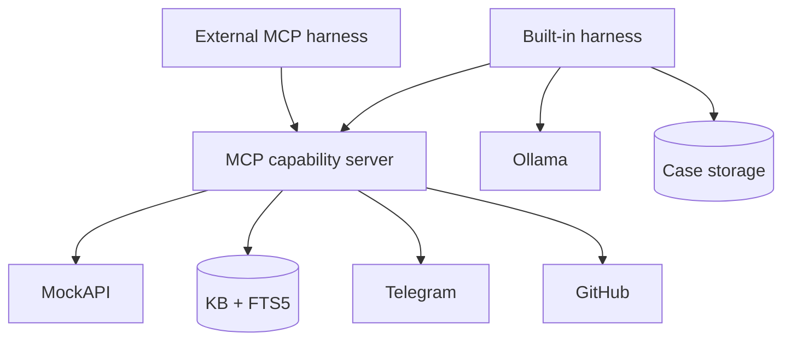
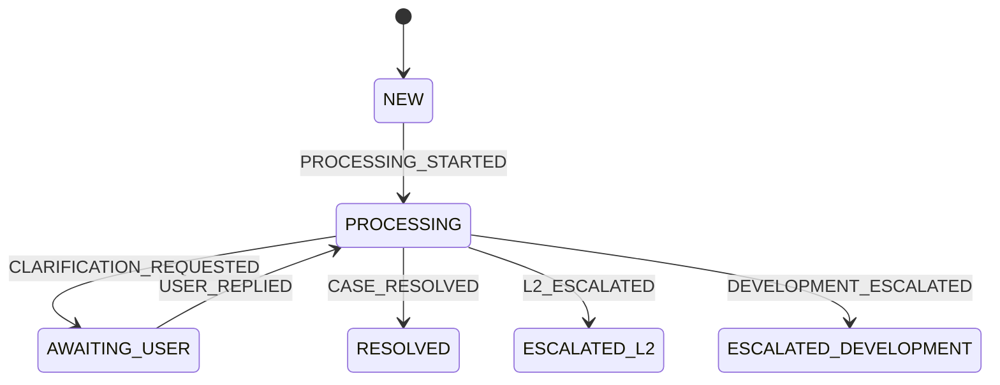

# L1 Support Agent

A bounded L1 support harness backed by a reusable stdio MCP capability server.

The built-in harness processes MockAPI tickets, searches a local knowledge base, resolves known issues, and safely routes unresolved infrastructure or software problems. Another MCP-compatible harness can reuse the same company capabilities with its own policy.

> **Built-in invariant:** the model proposes; Python authorizes, validates, and transitions.

## Architecture



The MCP server exposes capabilities, not the built-in Case policy. [`tool_policy.py`](src/l1_support_agent/application/tool_policy.py), lifecycle persistence, validation, and bounded execution belong to the built-in harness.

| Document | Purpose |
|---|---|
| [Architecture](docs/architecture.md) | Code contracts, sequences, persistence, and safety boundaries |
| [MCP harnesses](docs/harnesses.md) | Reuse the capability server from another harness |
| [Demo guide](docs/demo.md) | Run the three outcomes and safe MCP smoke |
| [Design decisions](docs/decisions.md) | Key choices and rejected alternatives |

## Outcomes

KB search is mandatory. Retrieval returns candidates, the LLM makes a structured post-KB decision, and Python validates the decision before execution or transition. See the [combined processing sequence](docs/architecture.md#combined-ticket-processing-sequence).

| Outcome | When | Capability | Final state |
|---|---|---|---|
| KB resolution | A returned article directly solves the ticket | `search_kb` | `RESOLVED` |
| L2 escalation | No adequate article; infrastructure/support issue | `escalate_l2` | `ESCALATED_L2` |
| Development escalation | No adequate article; software defect | `create_github_issue` | `ESCALATED_DEVELOPMENT` |

## Lifecycle



Legal transitions live in [`domain/transitions.py`](src/l1_support_agent/domain/transitions.py). The clarification states exist, but that business flow is not implemented yet.

## MCP capabilities

```bash
uv run l1-support-agent-mcp
```

| Tool | Role | Side effect |
|---|---|---|
| `list_tickets` | List source tickets | None |
| `get_ticket` | Fetch one ticket | None |
| `search_kb` | Search SQLite FTS5 | None |
| `escalate_l2` | Deliver L2 summary | Mock result or Telegram message |
| `create_github_issue` | Deliver defect context | Mock URL or GitHub issue |

The safe default is `SUPPORT_SIDE_EFFECT_MODE=mock`: the real agent, MCP invocation, policy, validation, and transitions run normally, while deterministic network-free adapters replace only the final external writes. The built-in model does not know which adapter is selected. External harnesses must enforce their own authorization.

## Skills

Packaged Markdown skills define triage, KB investigation, escalation, and knowledge-update instructions. They are reusable guidance—not authorization, executable plugins, or state mutation. See [`src/l1_support_agent/skills/`](src/l1_support_agent/skills/).

## Self-learning

Self-learning is an explicit application workflow, not an MCP write tool. Only an escalated Case plus a caller-supplied verified resolution is eligible. Python uses a stable article ID, checks duplicate candidates, and builds content from trusted inputs. See the [self-learning sequence](docs/architecture.md#self-learning-sequence).

## Setup

Requirements: Python 3.13+, [uv](https://docs.astral.sh/uv/), and Ollama for the built-in harness.

```bash
uv sync
cp .env.example .env
set -a; source .env; set +a
export SUPPORT_SIDE_EFFECT_MODE=mock
ollama pull qwen3.5:4b
uv run python -m l1_support_agent.demo_kb
```

Run the demo KB seed before Scenario A. It adds a synthetic bilingual POST/beep article for lexical FTS5 candidate retrieval. The application reads exported environment variables; it does not parse `.env` itself.

| Variable | Default / requirement |
|---|---|
| `SUPPORT_DB_PATH` | `support.db` |
| `SUPPORT_SIDE_EFFECT_MODE` | `mock` (safe default) or `real` |
| `LLM_BASE_URL` | `http://localhost:11434` |
| `LLM_MODEL` | `qwen3.5:4b` |
| `TELEGRAM_BOT_TOKEN`, `TELEGRAM_CHAT_ID` | Required only for real L2 escalation |
| `GITHUB_TOKEN`, `GITHUB_REPOSITORY` | Required only for real development escalation |
| `GITHUB_API_URL` | `https://api.github.com` |

## Run

CLI:

```bash
uv run l1-support-agent process 1
uv run l1-support-agent learn CASE_UUID --resolution "Verified resolution from L2"
```

REST:

```bash
uv run uvicorn l1_support_agent.api:app --host 127.0.0.1 --port 8000
curl http://127.0.0.1:8000/health
curl -X POST http://127.0.0.1:8000/tickets/1/process
```

`process` reads its ticket through MCP. `learn` is a trusted application use case and intentionally bypasses the general MCP capability set.

## Demo

| Scenario | Result | Evidence |
|---|---|---|
| Known KB issue | `RESOLVED` | Grounded support answer |
| Infrastructure issue | `ESCALATED_L2` | Valid Telegram `message_id` |
| Software defect | `ESCALATED_DEVELOPMENT` | Non-empty GitHub issue URL |
| Verified learning | Case state unchanged | Created or existing KB article |

Use [docs/demo.md](docs/demo.md) for ticket selection, side-effect guardrails, idempotency checks, and a no-side-effect MCP discovery smoke.

### Optional real integrations

Set `SUPPORT_SIDE_EFFECT_MODE=real` and configure the corresponding Telegram or GitHub credentials only when actual external writes are intended. Real mode never falls back to mock when credentials are missing.

## Testing

```bash
uv run pytest
uv run ruff check .
uv build
```

Automated tests do not contact MockAPI, Ollama, Telegram, or GitHub. The real stdio interoperability test performs tool discovery only.

## Limitations

- No polling, background worker, authentication, or implemented clarification flow.
- FTS5 retrieval is lexical; the LLM judges candidate relevance.
- The public MockAPI URL is fixed in its integration adapter.
- External harnesses do not inherit built-in Case persistence, policy, validation, or self-learning safeguards.
- Verified learning requires an explicit external/human resolution; there are no Telegram callbacks or GitHub webhooks.
