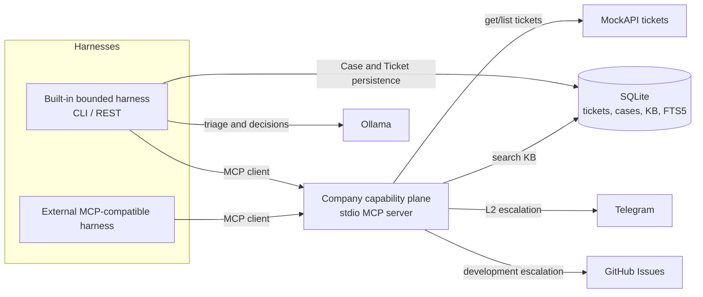
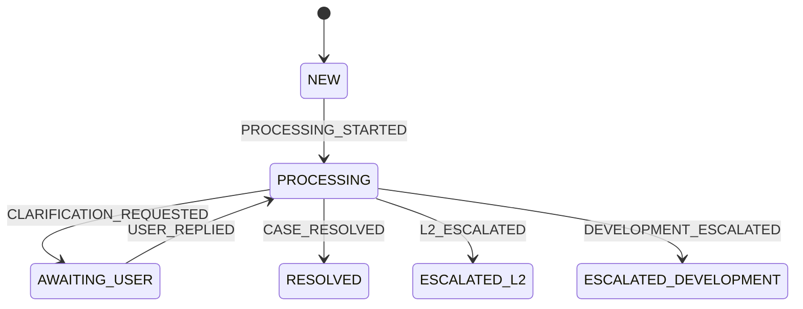

# L1 Support Agent

## 1. Project overview

A bounded L1 support harness plus a reusable stdio MCP capability server.

- The **company capability plane** exposes read-only tickets, KB search, Telegram escalation, and GitHub issue creation.
- The **built-in harness** adds Case persistence, deterministic lifecycle and tool policy, a bounded Ollama loop, structured validation, skills, and verified self-learning.
- An **external MCP-compatible harness** can reuse the capability plane, but must provide its own orchestration and authorization.

Core invariant for the built-in harness: **the model proposes; Python authorizes, validates, and transitions.**

See [architecture](docs/architecture.md), [external harness usage](docs/harnesses.md), and the [demo guide](docs/demo.md).

## 2. What the system does

| Surface | Responsibility | Code |
|---|---|---|
| MCP capability server | Portable company tools over stdio | [`mcp/server.py`](src/l1_support_agent/mcp/server.py) |
| Built-in CLI/REST harness | Process and persist a ticket lifecycle | [`interfaces.py`](src/l1_support_agent/interfaces.py) |
| Support runtime | Mandatory KB search, post-KB decision, validated outcome | [`agent/runtime.py`](src/l1_support_agent/agent/runtime.py) |
| Explicit learning | Capture a verified post-escalation resolution | [`learn_from_resolution.py`](src/l1_support_agent/application/learn_from_resolution.py) |

## 3. Architecture at a glance



MCP advertises capabilities; it does not enforce [`tool_policy.py`](src/l1_support_agent/application/tool_policy.py). That Case-aware policy belongs to the built-in harness.

## 4. Ticket lifecycle



The transition table is [`domain/transitions.py`](src/l1_support_agent/domain/transitions.py). Clarification states exist, but the current runtime does not implement that business flow.

## 5. Agent decision flow

```mermaid
sequenceDiagram
    actor Caller
    participant Harness as Built-in harness
    participant MCP as MCP capability server
    participant Source as MockAPI
    participant DB as SQLite repositories
    participant LLM as Ollama
    participant Ext as Telegram / GitHub

    Caller->>Harness: process(ticket_id)
    Harness->>MCP: get_ticket(ticket_id)
    MCP->>Source: read ticket
    Source-->>MCP: source payload
    MCP-->>Harness: structured Ticket
    Harness->>DB: save Ticket; load/create Case
    opt Case is NEW
        Harness->>LLM: triage skill + schema
        LLM-->>Harness: category + priority
        Harness->>DB: persist PROCESSING Case
    end
    Harness->>MCP: discover tools
    Harness->>LLM: only policy-visible search_kb
    LLM-->>Harness: search_kb(query)
    Harness->>Harness: authorize call
    Harness->>MCP: search_kb(query)
    MCP-->>Harness: candidate articles
    Harness->>LLM: structured post-KB decision; tools=[]
    alt A — adequate KB article
        LLM-->>Harness: resolve + article_id + answer
        Harness->>Harness: validate returned ID and answer
        Harness->>DB: CASE_RESOLVED
    else B — infrastructure/support problem
        LLM-->>Harness: escalate_l2 + summary
        Harness->>Harness: validate and authorize
        Harness->>MCP: escalate_l2(summary, reference)
        MCP->>Ext: Telegram sendMessage
        Ext-->>MCP: Telegram response
        MCP-->>Harness: integer message_id
        Harness->>DB: L2_ESCALATED
    else C — software defect
        LLM-->>Harness: create_github_issue + title + context
        Harness->>Harness: validate and authorize
        Harness->>MCP: create_github_issue(trusted ticket fields)
        MCP->>Ext: create GitHub issue
        Ext-->>MCP: GitHub response
        MCP-->>Harness: non-empty issue_url
        Harness->>DB: DEVELOPMENT_ESCALATED
    end
    Harness-->>Caller: typed JSON result
```

Terminal persisted cases short-circuit before triage, KB search, or external side effects.

## 6. Skills

Packaged skills live in [`src/l1_support_agent/skills/`](src/l1_support_agent/skills/) and are loaded explicitly by [`agent/skills.py`](src/l1_support_agent/agent/skills.py).

| Skill | Prompt use | Authority |
|---|---|---|
| `triage` | category and priority | instructions only |
| `kb-investigation` | search and semantic relevance | instructions only |
| `l2-escalation` | structured L2 outcome | instructions only |
| `development-escalation` | structured development outcome | instructions only |
| `knowledge-update` | duplicate/create learning decision | instructions only |

Skills can be reused by another harness as operational guidance. They never grant tool access or mutate lifecycle state.

## 7. MCP tools

Launch the standalone capability plane with:

```bash
uv run l1-support-agent-mcp
```

| Tool | Capability | Mutates external state? | Built-in model sees it directly? |
|---|---|---:|---:|
| `list_tickets` | list source tickets | no | no |
| `get_ticket` | fetch one source ticket | no | no |
| `search_kb` | search SQLite FTS5 | no | yes, before KB search only |
| `escalate_l2` | send Telegram escalation | yes | no; Python executes a validated outcome |
| `create_github_issue` | create development issue | yes | no; Python executes a validated outcome |

The server initializes the SQLite schema on startup and requires no Ollama configuration. See [docs/harnesses.md](docs/harnesses.md) for the portable MCP contract.

## 8. Self-learning

Self-learning is intentionally outside the general MCP tool set.

| Step | Deterministic safeguard |
|---|---|
| Load Case | only `ESCALATED_L2` or `ESCALATED_DEVELOPMENT` is eligible |
| Accept resolution | caller must supply non-empty verified facts |
| Check idempotency | stable ID `learned-case-{case_id}` |
| Search duplicates | results are candidates, not automatic matches |
| LLM decision | only `create` or `skip_existing`; tools disabled |
| Write article | Python builds content from ticket + verified resolution |

Full sequence: [architecture — self-learning](docs/architecture.md#self-learning-sequence).

## 9. Setup

Requirements: Python 3.13+, [uv](https://docs.astral.sh/uv/), and Ollama for the built-in harness.

```bash
uv sync
cp .env.example .env
set -a; source .env; set +a
ollama pull qwen3.5:4b
uv run python -m l1_support_agent.demo_kb
```

The application reads process environment variables; it does not parse `.env` itself.

## 10. Configuration

| Variable | Default | Used by |
|---|---|---|
| `SUPPORT_DB_PATH` | `support.db` | built-in persistence and MCP KB |
| `LLM_BASE_URL` | `http://localhost:11434` | built-in harness only |
| `LLM_MODEL` | `qwen3.5:4b` | built-in harness only |
| `TELEGRAM_BOT_TOKEN` | none | `escalate_l2` only |
| `TELEGRAM_CHAT_ID` | none | `escalate_l2` only |
| `GITHUB_TOKEN` | none | `create_github_issue` only |
| `GITHUB_REPOSITORY` | none | `create_github_issue`; `owner/repository` |
| `GITHUB_API_URL` | `https://api.github.com` | `create_github_issue` |

## 11. CLI usage

```bash
uv run l1-support-agent process 1
uv run l1-support-agent learn CASE_UUID --resolution "Verified resolution from L2"
```

The built-in `process` command obtains its source ticket through MCP. `learn` is a trusted application use case and does not use MCP.

## 12. REST API usage

```bash
uv run uvicorn l1_support_agent.api:app --host 127.0.0.1 --port 8000
curl http://127.0.0.1:8000/health
curl -X POST http://127.0.0.1:8000/tickets/1/process
curl -X POST http://127.0.0.1:8000/cases/CASE_UUID/learn \
  -H 'Content-Type: application/json' \
  -d '{"verified_resolution":"Verified resolution from L2"}'
```

`GET /health` performs no external calls.

## 13. Testing

```bash
uv run pytest
uv run ruff check .
uv build
```

Automated tests fake MockAPI, Ollama, Telegram, and GitHub. MCP stdio discovery is also verified without invoking side-effect tools.

## 14. Demo walkthrough

| Scenario | Input | Expected MCP calls | Final state | Evidence |
|---|---|---|---|---|
| A: known solution | matching POST/beep ticket | `get_ticket`, `search_kb` | `RESOLVED` | grounded answer |
| B: infrastructure | outage without KB solution | `get_ticket`, `search_kb`, `escalate_l2` | `ESCALATED_L2` | Telegram `message_id` |
| C: software defect | defect without KB solution | `get_ticket`, `search_kb`, `create_github_issue` | `ESCALATED_DEVELOPMENT` | GitHub issue URL |
| Learning | escalated Case + verified resolution | none | unchanged | created/existing KB article |

Guardrails and a no-side-effect MCP smoke are in [docs/demo.md](docs/demo.md).

## 15. Known limitations

- No polling, background worker, or authentication layer.
- The clarification lifecycle exists, but `request_clarification` is not implemented.
- FTS5 retrieval is lexical; the LLM performs relevance judgment over candidates.
- The public MockAPI URL is fixed in its integration adapter.
- External MCP harnesses do not automatically inherit Case persistence, built-in policy, validation, or self-learning safeguards.
- Verified learning requires an explicit external/human resolution; there are no Telegram callbacks or GitHub webhooks.
