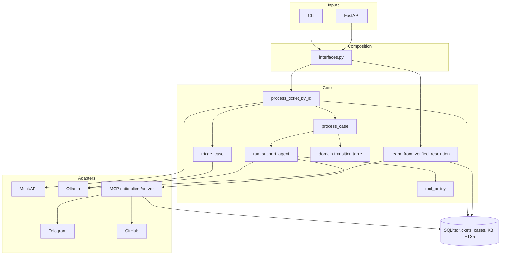
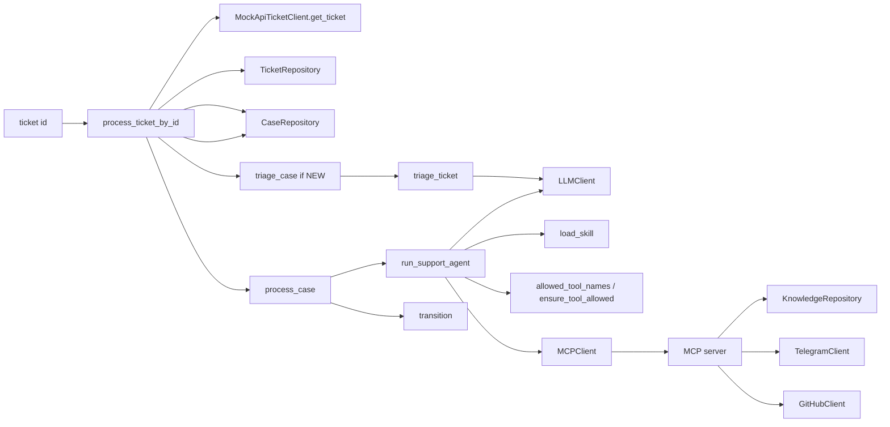
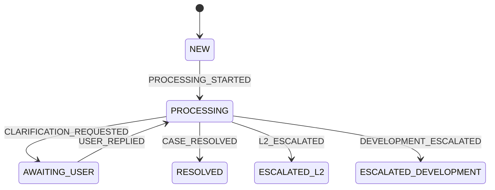
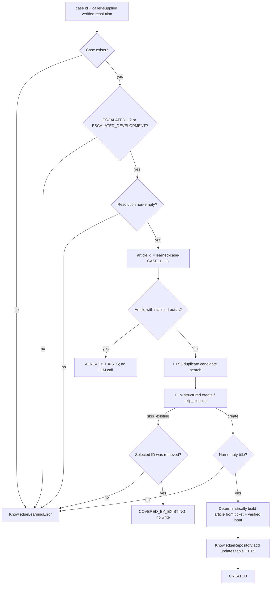
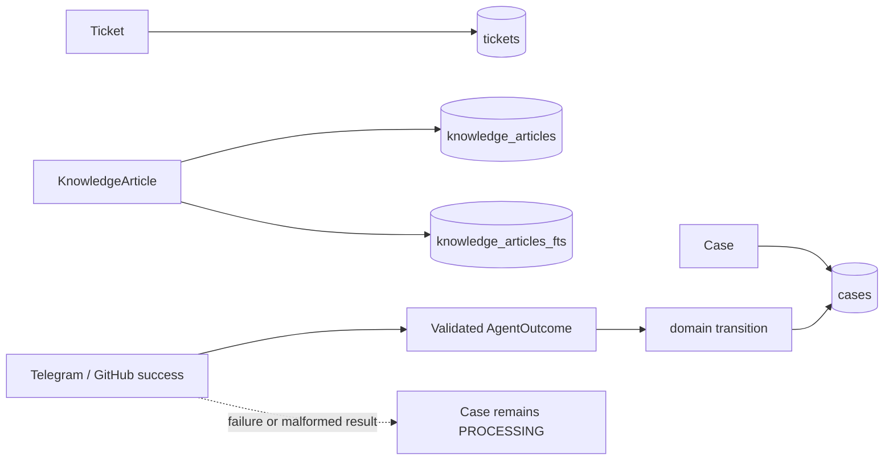

# Architecture

## System boundary

The project is a bounded single-agent application. Ollama selects actions and structured outcomes. Python owns authorization, validation, persistence, and state transitions.



## Repository/module map

| Module | Responsibility | Key code |
|---|---|---|
| `domain/` | Case identity, states, events, legal transitions | `Case`, `CaseState`, `Events`, `transition` |
| `application/` | Orchestrate use cases; map successful outcomes to events | `process_ticket_by_id`, `triage_case`, `process_case`, `learn_from_verified_resolution`, `tool_policy` |
| `agent/` | Triage parsing, bounded tool loop, post-KB decision validation, skill loader | `triage_ticket`, `run_support_agent`, `load_skill` |
| `llm/` | Provider-neutral protocol and Ollama adapter | `LLMClient`, `ToolDefinition`, `OllamaClient` |
| `mcp/` | Generic stdio client adapter and capability server | `SessionMCPClient`, `connect_stdio_mcp`, `search_kb`, `escalate_l2`, `create_github_issue` |
| `integrations/` | External HTTP adapters | `MockApiTicketClient`, `TelegramClient`, `GitHubClient` |
| `knowledge/` | Knowledge model and SQLite FTS5 search/write | `KnowledgeArticle`, `KnowledgeRepository` |
| `persistence/` | Schema, connections, ticket/case repositories | `init_database`, `TicketRepository`, `CaseRepository` |
| interface modules | Shared composition, CLI, REST | `interfaces.py`, `cli.py`, `api.py` |
| `skills/` | Packaged Markdown instructions used in prompts | `src/l1_support_agent/skills/*/SKILL.md` |

## Processing components



`process_ticket_by_id` creates the deterministic Case ID from `source:source_id`, persists intermediate triage state, and short-circuits persisted terminal cases. It does not duplicate triage or support-agent rules.

## Scenario A — known KB resolution

```mermaid
sequenceDiagram
    participant App as process_ticket_by_id
    participant Triage as triage_case
    participant Agent as run_support_agent
    participant Policy as tool_policy
    participant MCP as search_kb
    participant KB as SQLite FTS5
    participant LLM as Ollama
    participant State as transition

    App->>Triage: NEW Case
    Triage->>LLM: ticket + triage skill + schema
    LLM-->>Triage: category, priority, reasoning
    Triage-->>App: PROCESSING Case
    App->>Agent: process
    Agent->>Policy: allowed names, kb_searched=false
    Policy-->>Agent: search_kb only
    Agent->>LLM: visible search_kb definition
    LLM-->>Agent: search_kb(query)
    Agent->>Policy: authorize immediately before execution
    Agent->>MCP: search_kb(query)
    MCP->>KB: FTS5 search
    KB-->>Agent: candidate articles
    Agent->>LLM: ticket + candidates + structured schema; tools=[]
    LLM-->>Agent: resolve + article_id + grounded answer
    Agent->>Agent: validate returned ID and non-empty answer
    Agent-->>App: RESOLVED outcome
    App->>State: CASE_RESOLVED
    State-->>App: RESOLVED
```

Retrieval is not proof of relevance. Resolution requires the model to select an ID actually returned by `search_kb`; [`agent/runtime.py`](../src/l1_support_agent/agent/runtime.py) enforces this.

## Scenario B — L2 escalation

```mermaid
sequenceDiagram
    participant Agent as run_support_agent
    participant KB as search_kb
    participant LLM as Ollama
    participant Policy as tool_policy
    participant MCP as MCP server
    participant TG as Telegram API
    participant App as process_case
    participant State as transition

    Agent->>KB: mandatory search
    KB-->>Agent: no adequate candidate
    Agent->>LLM: ticket + candidates + L2 skill; tools=[]
    LLM-->>Agent: escalate_l2 + factual summary
    Agent->>Agent: validate non-empty summary
    Agent->>Policy: ensure escalate_l2 allowed
    Agent->>MCP: escalate_l2(summary, ticket reference)
    MCP->>TG: sendMessage
    TG-->>MCP: message_id
    MCP-->>Agent: {message_id: integer}
    Agent->>Agent: validate MCP result
    Agent-->>App: ESCALATED_L2 outcome
    App->>State: L2_ESCALATED
    State-->>App: ESCALATED_L2
```

No transition occurs if Telegram fails or `message_id` is malformed.

## Scenario C — development escalation

```mermaid
sequenceDiagram
    participant Agent as run_support_agent
    participant KB as search_kb
    participant LLM as Ollama
    participant Policy as tool_policy
    participant MCP as MCP server
    participant GH as GitHub API
    participant App as process_case
    participant State as transition

    Agent->>KB: mandatory search
    KB-->>Agent: no adequate candidate
    Agent->>LLM: ticket + candidates + development skill; tools=[]
    LLM-->>Agent: create_github_issue + title + technical context
    Agent->>Agent: validate title and context
    Agent->>Policy: ensure create_github_issue allowed
    Agent->>MCP: title, context, ticket description, actual logs, reference
    MCP->>GH: POST repository issue
    GH-->>MCP: html_url
    MCP-->>Agent: {issue_url: string}
    Agent->>Agent: validate non-empty issue_url
    Agent-->>App: ESCALATED_DEVELOPMENT outcome
    App->>State: DEVELOPMENT_ESCALATED
    State-->>App: ESCALATED_DEVELOPMENT
```

Only metadata keys `errors`, `error`, `logs`, and `stack_trace` are forwarded. If absent, the issue says `Not provided`.

## State machine



The table in [`domain/transitions.py`](../src/l1_support_agent/domain/transitions.py) contains lifecycle rules only. Tool permissions never enter this table.

## Tool authorization

```mermaid
flowchart TD
    Case{Case state?}
    Case -->|not PROCESSING| None[Allowed names = empty]
    Case -->|PROCESSING| SearchDone{AgentContext.kb_searched?}
    SearchDone -->|false| SearchOnly[Allowed names = search_kb]
    SearchDone -->|true| Next[Allowed names = request_clarification, escalate_l2, create_github_issue]

    Skills[Markdown skills] -.instructions only.-> Prompt[LLM prompt]
    SearchOnly --> Intersect[Intersect policy names with discovered MCP tools]
    Intersect --> Visible[Tools visible to LLM]
    Visible --> Requested[LLM tool request]
    Requested --> Recheck[ensure_tool_allowed]
    Recheck --> Execute[MCP execution]

    Next --> Structured[Current runtime uses structured post-KB decision with tools=[]]
    Structured --> Validate[Python validates decision]
    Validate --> Recheck2[ensure_tool_allowed before escalation execution]
    Recheck2 --> Execute
```

`request_clarification` is present in the policy's next-stage names but has no MCP implementation. Skills never expand the allowed set.

## Self-learning



The learning LLM only judges duplicate coverage and proposes a title. It cannot supply resolution content, mutate the Case, or call a KB-write tool.

## Persistence and failure boundaries



SQLite writes use explicit repositories. `KnowledgeRepository.add()` updates both the regular table and FTS5 index in one repository operation.
