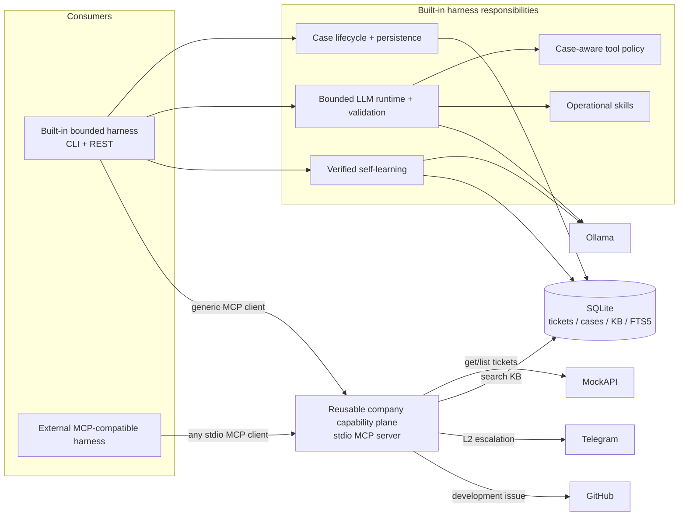
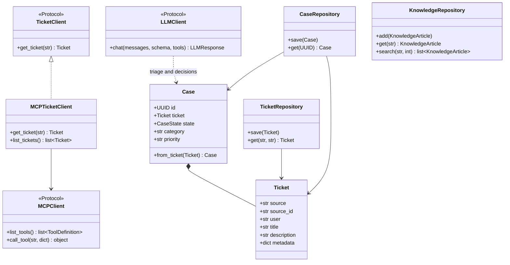
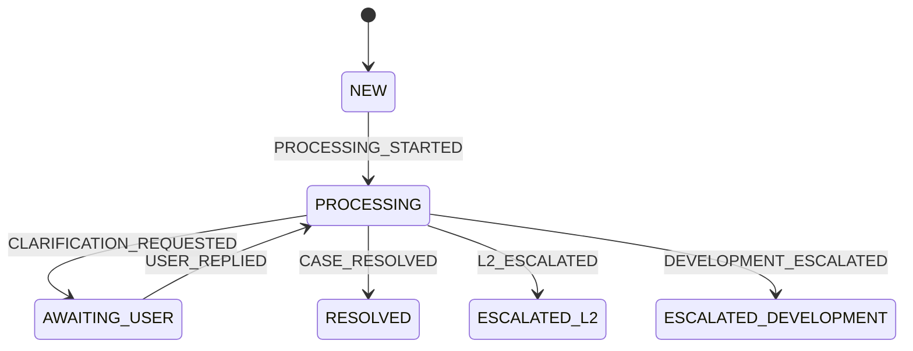
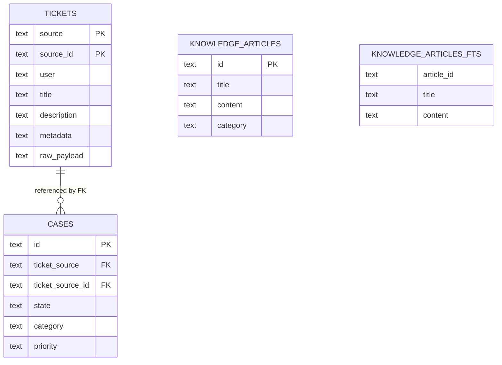

# Architecture

## Capability plane and harness boundary



The MCP server exposes capabilities and schemas. It has no Case, lifecycle, LLM, or built-in policy dependency. An external harness supplies its own authorization unless it deliberately reuses application-layer code.

## Repository tree

```text
src/l1_support_agent/
├── agent/                  bounded runtime, triage parser, skill loader
├── application/            ticket processing, Case processing, policy, learning
├── domain/                 Ticket, Case, states, events, transitions
├── integrations/
│   ├── tickets/mockapi.py  external source adapter
│   ├── tickets/mcp.py      MCP payload -> domain Ticket adapter
│   ├── telegram.py         L2 HTTP adapter
│   └── github.py           issue HTTP adapter
├── knowledge/              KnowledgeArticle and SQLite FTS repository
├── llm/                    provider-neutral protocol and Ollama adapter
├── mcp/
│   ├── client.py           generic MCP transport adapter
│   └── server.py           reusable company capabilities
├── persistence/            schema and Ticket/Case repositories
├── skills/                 packaged operational SKILL.md files
├── api.py                  FastAPI transport
├── cli.py                  argparse transport
├── interfaces.py           runtime composition and resource ownership
└── demo_kb.py              idempotent synthetic KB seed
```

## Important code contracts



[`process_ticket_by_id`](../src/l1_support_agent/application/process_ticket.py) accepts the `TicketClient` protocol. Runtime composition supplies `MCPTicketClient`; application tests can continue to supply small fakes.

## Combined ticket-processing sequence

```mermaid
sequenceDiagram
    actor Caller
    participant App as process_ticket_by_id
    participant TicketMCP as MCPTicketClient
    participant MCP as MCP server
    participant Source as MockApiTicketClient / MockAPI
    participant DB as TicketRepository / CaseRepository
    participant LLM as LLMClient
    participant Runtime as run_support_agent
    participant Policy as built-in tool_policy
    participant External as Telegram / GitHub

    Caller->>App: ticket_id
    App->>TicketMCP: get_ticket(ticket_id)
    TicketMCP->>MCP: call_tool(get_ticket)
    MCP->>Source: read source ticket
    Source-->>MCP: domain Ticket
    MCP-->>TicketMCP: {ticket: structured payload}
    TicketMCP-->>App: validated domain Ticket
    App->>DB: persist Ticket; load/create deterministic Case
    opt Case is NEW
        App->>LLM: triage skill + output schema
        LLM-->>App: validated category + priority
        App->>DB: persist PROCESSING
    end
    App->>Runtime: process Case
    Runtime->>MCP: list_tools
    MCP-->>Runtime: five capability definitions
    Runtime->>Policy: allowed names before KB
    Policy-->>Runtime: search_kb only
    Runtime->>LLM: ticket + visible search_kb
    LLM-->>Runtime: search_kb(query)
    Runtime->>Policy: ensure_tool_allowed(search_kb)
    Runtime->>MCP: search_kb(query)
    MCP-->>Runtime: {articles: candidates}
    Runtime->>LLM: candidates + post-KB schema; tools=[]
    alt A — adequate article
        LLM-->>Runtime: resolve + returned article_id + answer
        Runtime->>Runtime: validate ID and grounded answer
        Runtime-->>App: RESOLVED outcome
        App->>DB: apply CASE_RESOLVED; persist
    else B — infrastructure/support
        LLM-->>Runtime: escalate_l2 + factual summary
        Runtime->>Policy: ensure_tool_allowed(escalate_l2)
        Runtime->>MCP: escalate_l2(summary, ticket reference)
        MCP->>External: Telegram sendMessage
        External-->>MCP: message_id
        MCP-->>Runtime: {message_id: integer}
        Runtime-->>App: ESCALATED_L2 outcome
        App->>DB: apply L2_ESCALATED; persist
    else C — software defect
        LLM-->>Runtime: create_github_issue + title + context
        Runtime->>Policy: ensure_tool_allowed(create_github_issue)
        Runtime->>MCP: trusted ticket fields + decision fields
        MCP->>External: GitHub issue POST
        External-->>MCP: html_url
        MCP-->>Runtime: {issue_url: non-empty string}
        Runtime-->>App: ESCALATED_DEVELOPMENT outcome
        App->>DB: apply DEVELOPMENT_ESCALATED; persist
    end
    App-->>Caller: TicketProcessingResult
```

`get_ticket` and `list_tickets` are ingestion capabilities. The built-in LLM never sees them because the Case-aware policy intersects discovered MCP tools with its allowed-name set.

## Case state machine



Only [`domain/transitions.py`](../src/l1_support_agent/domain/transitions.py) defines legal lifecycle transitions. MCP does not expose state mutation.

## SQLite data model



`knowledge_articles_fts` mirrors searchable article fields, but SQLite does not enforce a foreign key between it and `knowledge_articles`. `KnowledgeRepository.add()` maintains both tables.

## MCP capability matrix

| Capability | MCP tool | Access | External side effect | Built-in usage | Built-in model sees directly? | Built-in policy gate |
|---|---|---|---:|---|---:|---|
| Ticket discovery | `list_tickets` | read | no | optional inspection | no | not part of agent loop |
| Ticket ingestion | `get_ticket` | read | no | `MCPTicketClient` before Case processing | no | composition boundary |
| KB investigation | `search_kb` | read | no | mandatory first agent action | yes | PROCESSING + `kb_searched=False` |
| L2 delivery | `escalate_l2` | write | Telegram message | validated post-KB outcome | no (`tools=[]`) | PROCESSING + `kb_searched=True` |
| Development delivery | `create_github_issue` | write | GitHub issue | validated post-KB outcome | no (`tools=[]`) | PROCESSING + `kb_searched=True` |

For an external harness, all five tools are discoverable. Its own policy decides which definitions reach its model and which calls may execute.

## Validation and failure boundaries

| Boundary | Deterministic validation | Failure behavior | Case transition? |
|---|---|---|---:|
| MockAPI → MCP | existing MockAPI response-shape checks | HTTP/type error | no |
| MCP → `MCPTicketClient` | wrapper, required string fields, metadata object | `MCPTicketPayloadError` | no |
| Triage LLM → application | exact category/priority vocabularies and string reasoning | error; triage result not persisted | no terminal transition |
| Agent tool request → MCP | `ensure_tool_allowed()` immediately before execution | `ToolNotAllowedError` | no |
| `search_kb` → runtime | object wrapper, article list, non-empty article IDs | `AgentRuntimeError` | no |
| Resolve decision → runtime | returned article ID and non-empty answer | `AgentRuntimeError` | no |
| Telegram → runtime | result object with integer, non-boolean `message_id` | `AgentRuntimeError` | no |
| GitHub → runtime | result object with non-empty `issue_url` | `AgentRuntimeError` | no |
| Outcome → domain | legal state/event pair | `InvalidTransitionError` | no |

MCP tool discovery is not authorization. Skills are prompt instructions, not authorization. Only the built-in harness applies `allowed_tool_names()` and `ensure_tool_allowed()`.

## Self-learning sequence

```mermaid
sequenceDiagram
    actor Caller as Human / verified external workflow
    participant Learn as learn_from_verified_resolution
    participant Cases as CaseRepository
    participant KB as KnowledgeRepository
    participant LLM as LLMClient
    participant SQLite as KB table + FTS5

    Caller->>Learn: case_id + verified_resolution
    Learn->>Cases: get(case_id)
    Cases-->>Learn: persisted Case
    Learn->>Learn: require escalated state and non-empty input
    Learn->>KB: get(learned-case-{case_id})
    alt stable article already exists
        KB-->>Learn: KnowledgeArticle
        Learn-->>Caller: ALREADY_EXISTS; no LLM call
    else first capture
        Learn->>KB: search(ticket + verified resolution)
        KB-->>Learn: duplicate candidates
        Learn->>LLM: knowledge-update skill + create/skip schema; tools=[]
        alt adequate candidate selected
            LLM-->>Learn: skip_existing + retrieved ID
            Learn->>Learn: validate ID was returned
            Learn-->>Caller: COVERED_BY_EXISTING
        else new knowledge
            LLM-->>Learn: create + title only
            Learn->>Learn: build content from ticket + caller input
            Learn->>SQLite: KnowledgeRepository.add(article)
            Learn-->>Caller: CREATED
        end
    end
```

Learning is a trusted application workflow, not a general MCP write tool. It does not mutate the source ticket or Case state.
