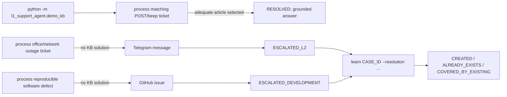

# Demo guide

This runbook exercises the real local composition layer. Scenario B sends one real Telegram message; Scenario C creates one real GitHub issue.

## Prerequisites

| Requirement | Check |
|---|---|
| Python 3.13+ and `uv` | `uv --version` |
| Ollama installed | `ollama --version` |
| MockAPI reachable | open the configured public ticket dataset |
| Telegram credentials | required only for Scenario B |
| GitHub token/repository | required only for Scenario C |

## Prepare the environment

```bash
uv sync
cp .env.example .env
# Edit .env without committing it.
set -a
source .env
set +a
```

Use a disposable database when demonstrating:

```bash
export SUPPORT_DB_PATH=/tmp/l1-support-agent-demo.db
```

The application does not parse `.env` itself; values must be exported into the process environment.

## Start Ollama

```bash
ollama serve
```

In another terminal:

```bash
ollama pull "${LLM_MODEL:-qwen3.5:4b}"
```

## Seed the synthetic demo KB

```bash
uv run python -m l1_support_agent.demo_kb
```

This idempotently adds one synthetic article about a computer that beeps during POST and does not boot. It writes through `KnowledgeRepository`, so both the KB table and FTS5 index are updated.

## Demo map



| Flow | Command | Expected visible evidence |
|---|---|---|
| A | `l1-support-agent process ID` | JSON state `resolved`; answer follows seeded article |
| B | `l1-support-agent process ID` | one Telegram message; state `escalated_l2` |
| C | `l1-support-agent process ID` | one GitHub issue URL; state `escalated` |
| Learn | `l1-support-agent learn UUID --resolution ...` | learning status and article ID |

## Inspect source tickets first

The public MockAPI dataset can change. Inspect it and use its actual fields; do not fabricate or edit remote tickets.

```bash
curl -fsS https://6a7ad74c8c69b3eb4a179621.mockapi.io/tickets/tickets
```

Choose:

- Scenario A: a hardware POST/beep ticket directly covered by the synthetic article. At the time of writing, ticket `1` is used by the local smoke workflow; verify before running.
- Scenario B: a genuine network/infrastructure outage with no adequate seeded KB article.
- Scenario C: a genuine software defect with no adequate seeded KB article.

If no defensible ticket exists for a scenario, skip it rather than changing MockAPI data.

## Run through the CLI

### Scenario A — known KB issue

```bash
uv run l1-support-agent process 1
```

Check the compact JSON:

1. `final_state` is `resolved`.
2. `category` and `priority` are populated.
3. `outcome_message` uses only instructions in the selected article.

Run it again. The `case_id` and final state must match; `outcome_message` is `null` because the persisted terminal Case short-circuits the agent.

### Scenario B — L2 escalation

Before running, confirm `TELEGRAM_BOT_TOKEN` and `TELEGRAM_CHAT_ID` point to the intended demo chat.

```bash
uv run l1-support-agent process INFRASTRUCTURE_TICKET_ID
```

Check:

- one concise Telegram message contains the ticket reference;
- JSON `final_state` is `escalated_l2` only after Telegram returns an integer `message_id`;
- a repeated command creates no second message.

### Scenario C — development escalation

Before running, confirm `GITHUB_REPOSITORY` points to the intended demo repository.

```bash
uv run l1-support-agent process SOFTWARE_TICKET_ID
```

Check:

- the issue includes title, factual context, source description, ticket reference, and only supplied errors/logs;
- JSON `final_state` is `escalated` only after GitHub returns an issue URL;
- a repeated command creates no second issue.

### Self-learning

Use an escalated Case ID and a resolution verified outside L1:

```bash
uv run l1-support-agent learn CASE_UUID \
  --resolution "Verified factual resolution supplied by L2 or development"
```

Expected statuses:

| Status | Meaning |
|---|---|
| `created` | deterministic article written to KB and FTS5 |
| `already_exists` | this Case was learned previously; no LLM call |
| `covered_by_existing` | LLM selected an adequate retrieved candidate; no write |

`NEW`, `PROCESSING`, `AWAITING_USER`, and ordinary `RESOLVED` cases are rejected.

## Run through REST

Start the server:

```bash
uv run uvicorn l1_support_agent.api:app --host 127.0.0.1 --port 8000
```

Then:

```bash
curl -fsS http://127.0.0.1:8000/health
curl -fsS -X POST http://127.0.0.1:8000/tickets/1/process
curl -fsS -X POST http://127.0.0.1:8000/cases/CASE_UUID/learn \
  -H 'Content-Type: application/json' \
  -d '{"verified_resolution":"Verified factual resolution"}'
```

CLI and REST delegate to the same functions in `interfaces.py`; business behavior is identical.

## Safe reset

Only remove the disposable path you explicitly selected:

```bash
rm -f /tmp/l1-support-agent-demo.db \
      /tmp/l1-support-agent-demo.db-shm \
      /tmp/l1-support-agent-demo.db-wal
```

This resets local SQLite state. It cannot undo Telegram messages or GitHub issues.
