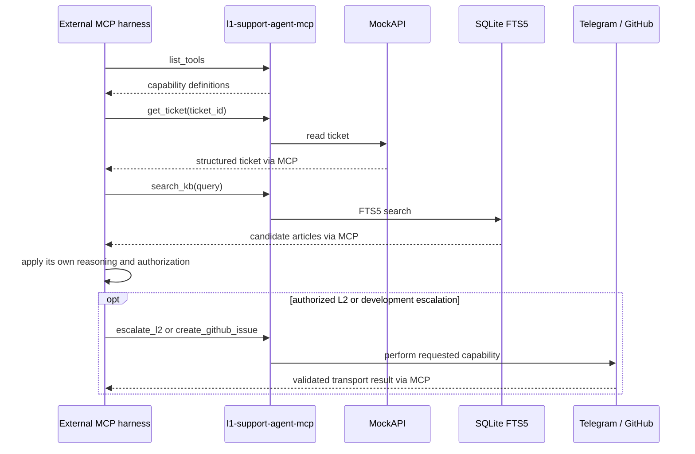

# Reusing the MCP capability server

The project ships a standalone company-capability plane for any stdio MCP-compatible harness. No vendor-specific SDK is required by the server.

## Portable launch contract

| Item | Value |
|---|---|
| Executable in this checkout | `uv run l1-support-agent-mcp` |
| Installed executable | `l1-support-agent-mcp` |
| Transport | stdio MCP |
| Ollama required | no |
| Startup behavior | idempotently initializes `SUPPORT_DB_PATH`, then serves tools |

The consuming harness should launch the command as its MCP child process and discover tools through the MCP protocol.

## Environment

| Variable | Required |
|---|---|
| `SUPPORT_DB_PATH` | optional; defaults to `support.db` |
| `TELEGRAM_BOT_TOKEN` | only when `escalate_l2` is called |
| `TELEGRAM_CHAT_ID` | only when `escalate_l2` is called |
| `GITHUB_TOKEN` | only when `create_github_issue` is called |
| `GITHUB_REPOSITORY` | only when `create_github_issue` is called |
| `GITHUB_API_URL` | optional; defaults to `https://api.github.com` |

The MCP server does not read `LLM_BASE_URL` or `LLM_MODEL`.

## Tool catalog

| Tool | Input | Structured result | Effect |
|---|---|---|---|
| `list_tickets` | none | `{"tickets": [...]}` | read MockAPI |
| `get_ticket` | `ticket_id` | `{"ticket": {...}}` | read MockAPI |
| `search_kb` | `query`, optional `limit` | `{"articles": [...]}` | read SQLite FTS5 |
| `escalate_l2` | `summary`, `ticket_reference` | `{"message_id": int}` | send Telegram message |
| `create_github_issue` | title, context, description, logs, reference | `{"issue_url": str}` | create GitHub issue |

Ticket payloads contain `source`, `source_id`, `user`, `title`, `description`, and `metadata`.

## Illustrative external-harness sequence

This sequence is illustrative. The external harness owns sequencing, reasoning, authorization, retries, and any state it needs.

## Capability is not authorization

| Concern | MCP server | Built-in harness | External harness |
|---|---:|---:|---:|
| Advertise schemas and execute tools | yes | consumes | consumes |
| Persist built-in Case lifecycle | no | yes | not inherited |
| Apply `allowed_tool_names()` | no | yes | not inherited |
| Validate built-in post-KB outcomes | no | yes | not inherited |
| Enforce bounded LLM steps | no | yes | not inherited |
| Run verified self-learning | no | explicit application use case | not exposed through MCP |

An external harness should apply equivalent authorization before side-effect tools. Merely discovering `escalate_l2` or `create_github_issue` does not make a call appropriate.

## Reusing operational skills

The packaged Markdown files under `src/l1_support_agent/skills/` may be supplied to another harness as operational instructions:

- `triage`;
- `kb-investigation`;
- `l2-escalation`;
- `development-escalation`;
- `knowledge-update`.

Skills describe behavior. They do not grant MCP access, enforce ordering, or validate results.

## Intentionally not exposed

- Case state-machine mutation;
- unrestricted KB writes;
- the verified self-learning write operation;
- ticket create, update, or delete operations.

These remain outside the portable capability plane to keep external side effects explicit and verified knowledge capture trusted.
